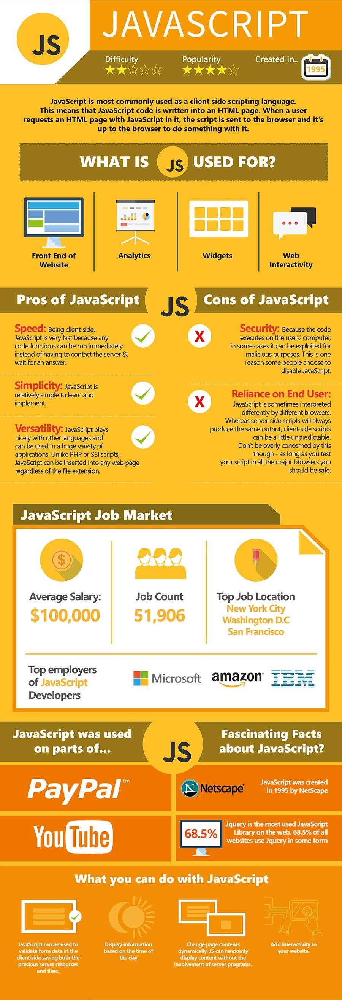

# zhengrr 所知的 JavaScript

[*GitHub Pages*](https://afoolsbag.github.io/rrJavaScript/)

> 

## Awesome

/ [*Awesome HTML5*](https://github.com/diegocard/awesome-html5)
/ [*Awesome CSS*](https://github.com/awesome-css-group/awesome-css)

/ [*Less*](http://lesscss.org/)
/ [*Sass*](https://sass-lang.com/)
/ [*Stylus*](http://stylus-lang.com/)

/ [*Babel*](https://babeljs.io/) 
    [*cmn-Hans*](https://babeljs.cn/) 
/ [*CoffeeScript*](https://coffeescript.org/)

/ [*SRI Hash Generator*](https://www.srihash.org)
/ [*Bootstrap*](https://getbootstrap.com/) 
    [*-中文网*](http://www.bootcss.com/) 
/ [*Dart*](https://dartlang.org/)
/ [*CoffeeScript*](https://coffeescript.org/)
/ [*Font Awesome*](https://fontawesome.com/)
/ [*Grunt*](https://gruntjs.com/)
/ [*gulp*](https://gulpjs.com/)
/ [*Jest*](https://jestjs.io/)
/ [*jQuery*](https://jquery.com/)
/ [*Vue*](https://vuejs.org/)
/ [*WebStorm*](https://jetbrains.com/webstorm/) 
    [*zh_CN*](https://github.com/pingfangx/jetbrains-in-chinese/tree/master/WebStorm) 

## 许可

项目采用 Unlicense 许可，文档采用 CC0-1.0 许可：

  
   
  To the extent possible under law,
  
    zhengrr
  has waived all copyright and related or neighboring rights to this work.

